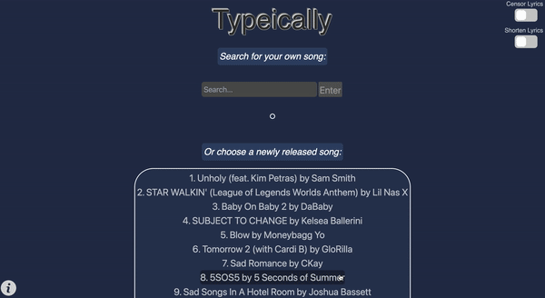
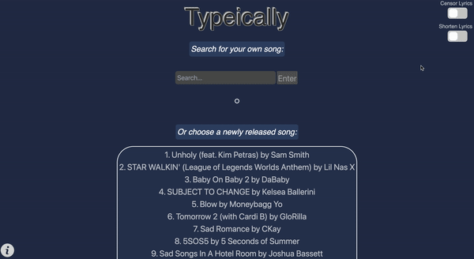

# Typeically
Typeically is a web-based typing app that allows you to find your favorite songs and type along to the lyrics! I created & developed this app alongside four classmates for my Spring 2022 Software Engineering course.
> Live demo [_here_](https://www.example.com). <!-- If you have the project hosted somewhere, include the link here. -->

## Table of Contents
* [General Info](#general-information)
* [Technologies Used](#technologies-used)
* [Features](#features)
* [Screenshots](#screenshots)
* [Setup](#setup)
* [Usage](#usage)
* [Project Status](#project-status)
* [Room for Improvement](#room-for-improvement)
* [Acknowledgements](#acknowledgements)
* [Contact](#contact)
<!-- * [License](#license) -->


## General Information

This web application aims to provide entertainment in the form of a typing game that allows you to type along to user selected lyrics. There is currently no application that allows users to type along to lyrics of a song that they inputted, and so our project aims to fulfill the want for such an application. The following demos below showcase the app’s main features.

### Demo 1:

You can use the search bar to find a song by artist, song name, or lyric content, and hit 'enter' to generate song options. Once you've found the result for the song you wish to type to, click on it and you'll be directed to the typing page. Upon finishing the song, you will receive your typing stats, including words per minute, accuracy and typing duration. You will have the option to submit your score to that song's specific leaderboard! You've got to be quick—only the top 5 completion times are displayed on the leaderboard!

 

### Demo 2:

You can also choose a song from the list of new releases. In addition, you can toggle the song length and censorship of explicit lyrics using the switches at the top-right of the screen. Return back to the song search page by clicking the Typeically header at the top left of the page.

 


## Technologies Used
Java, JavaScript, React, SQL

## Features
List the ready features here:
- Awesome feature 1
- Awesome feature 2
- Awesome feature 3


## Screenshots

<!-- If you have screenshots you'd like to share, include them here. -->

 I specifically worked on:
- the backend and frontend (React) aspects of the leaderboard, including setting up APIs to ensure the leaderboard is updated
- testing the leaderboard database from the backend by writing the JUnit tests
- the API handler to send the list of newly-released songs from Spotify to the frontend
- the frontend “choose a newly-released song” feature which allows users to choose a recent song
- testing all aspects of the frontend with Selenium
- helping my group members integrate their parts and making sure merges go smoothly


## Setup
What are the project requirements/dependencies? Where are they listed? A requirements.txt or a Pipfile.lock file perhaps? Where is it located?

Proceed to describe how to install / setup one's local environment / get started with the project.


## Usage

### To run the Typeically program:
    
1. Preferably use Chrome for your browser and download the [CORS UnBlock extension](https://docs.google.com/document/d/1kAGzs_0YeLkAXbZUFNlNNj2SrcmW8tcc3CuH0Uy6cQ8/edit#heading=h.iiwoysfq2rkn). Activate it by making sure the yellow light on the bug icon is visible.

2. In one terminal:
```
cd frontend    
cd type-client
npm start
```
3. In another terminal:
```    
cd backend
./run --gui
```
### To test the Typeically program:
    
Run the Junit and Selenium tests using:
```
cd backend
mvn test
```
*IMPORTANT:*
- Make sure you activate the CORS UnBlock extension in the browser when the selenium tabs open
- No need to download the extension for testing, it is preloaded.

## Project Status
Project is: Complete

## Room for Improvement
Include areas you believe need improvement / could be improved. Also add TODOs for future development.

Room for improvement:
- Improvement to be done 1
- Improvement to be done 2

To do:
- Feature to be added 1
- Feature to be added 2


## Acknowledgements
Give credit here.
- This project was inspired by...
- This project was based on [this tutorial](https://www.example.com).
- Many thanks to...


## Contact
Created by [@flynerdpl](https://www.flynerd.pl/) - feel free to contact me!


<!-- Optional -->
<!-- ## License -->
<!-- This project is open source and available under the [... License](). -->

<!-- You don't have to include all sections - just the one's relevant to your project -->
