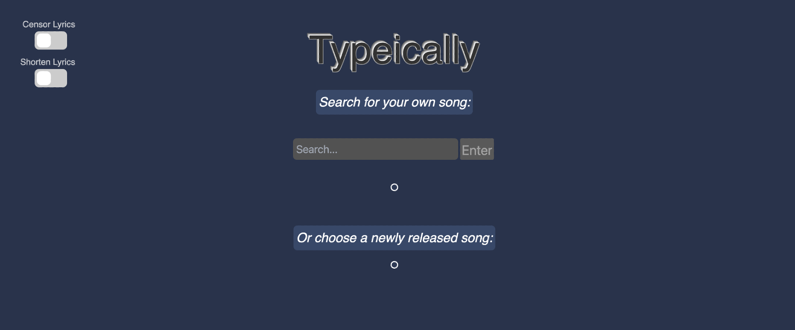

# Typeically

Typeically is a web-based typing app that allows you to find your favorite songs and type along to the lyrics! I created & developed this app alongside four classmates for my Spring 2022 Software Engineering course.

*The web application is no longer live as the course has finished since. However, demos are included below.*

<p align="center">
    
</p>

## Table of Contents
* [Technologies Used](#technologies-used)
* [General Info](#general-info)
* [Features and Demos](#features-and-demos)
* [Design Iterations](#design-iterations)
* [Testing](#testing)
* [Usage Instructions](#usage-instructions)
* [Project Status](#project-status)
* [Conclusion](#conclusion)
* [Acknowledgements](#acknowledgements)
* [Contact](#contact)
<!-- * [License](#license) -->

## Technologies Used
Java, JavaScript, React, SQL

## General Info

This project aims to provide entertainment in the form of a typing game that allows you to type along to user selected lyrics. There is currently no application that allows users to type along to lyrics of a song that they inputted, and so our project aims to fulfill the want for such an application.

## Features and Demos

The following demos below showcase the app’s main features.

### Demo of Search Bar & Typing:

You can use the search bar to find a song by artist, song name, or lyric content, and hit 'enter' to generate song options. Once you've found the result for the song you wish to type to, click on it and you'll be directed to the typing page. Upon finishing the song, you will receive your typing stats, including words per minute, accuracy and typing duration. You will have the option to submit your score to that song's specific leaderboard! You've got to be quick—only the top 5 completion times are displayed on the leaderboard!

<p align="center">
    
</p>

### Demo of New Releases Feature:

You can also choose a song from the list of new releases. In addition, you can toggle the song length and censorship of explicit lyrics using the switches at the top-right of the screen. Return back to the song search page by clicking the Typeically header at the top left of the page.

<p align="center">
    
</p>

## Design Iterations

The backend was developed using Java and fulfilled two main purposes: (1) retrieving the Spotify API data to load a list of newly released songs on the frontend and (2) storing the submissions to the leaderboard in an SQL file. I developed API Handlers to update the frontend with both forms of data.

A new table in the SQL database file is created for each song and is continuously updated with the user’s submissions. Only the 5 top submissions are displayed on the Frontend. The frontend communicates with the backend so that the tables in the database are up to date. On the frontend side of the app, the search bar feature was implemented using the Genius API, which provided us with search query results, song lyrics and song artwork.

There are some trade-offs with the design choices made: if the APIs break, then the application will no longer functional. However, it is not feasible to hold all this information in the backend. In addition, song information needs to be continuously updated with new data.

## Testing

The backend was tested with JUnit tests that targeted the API Handlers. The frontend was tested using Selenium to verify that all features of the app work in conjunction.
     
## Usage Instructions

### To run the Typeically program:
    
1. Preferably use Chrome for your browser and download the [CORS UnBlock extension](https://docs.google.com/document/d/1kAGzs_0YeLkAXbZUFNlNNj2SrcmW8tcc3CuH0Uy6cQ8/edit#heading=h.iiwoysfq2rkn). Activate it by making sure the yellow light on the bug icon is visible.

2. In one terminal:
```
cd frontend    
cd type-client
npm start
```
3. In another terminal:
```    
cd backend
./run --gui
```
### To test the Typeically program:
    
Run the Junit and Selenium tests using:
```
cd backend
mvn test
```
*IMPORTANT:*
- Make sure you activate the CORS UnBlock extension in the browser when the selenium tabs open
- No need to download the extension for testing, it is preloaded.

## Project Status
Project is: Complete (as of May 2022)

## Conclusion

I learned a lot about the software engineering cycle in general and realized how much I enjoyed working with both frontend and backend concurrently.


## Acknowledgements
Give credit here.
- This project was inspired by...
- This project was based on [this tutorial](https://www.example.com).
- Many thanks to...

## Contact
Created by [@flynerdpl](https://www.flynerd.pl/) - feel free to contact me!
